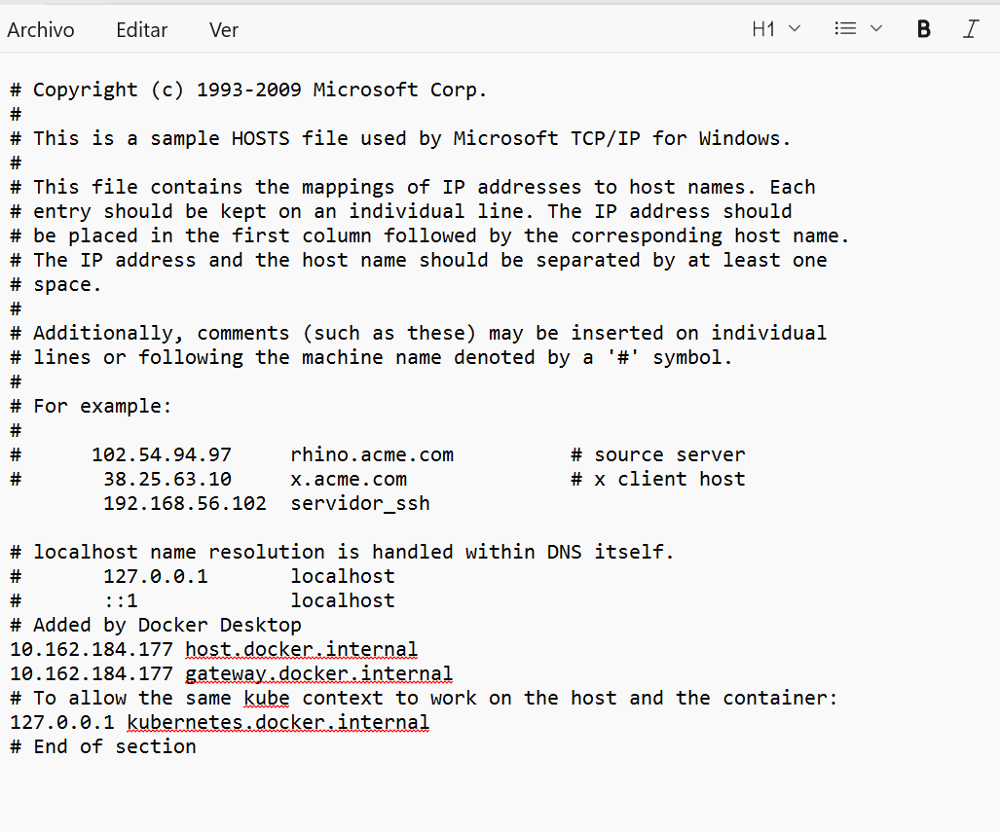

[Volver al inicio](../../index.md)

### 1. Preparación de la máquina y configuración de la red
Desde la interfaz de VirtualBox añade un segundo adaptador de red en modo red solo anfitrión

Indica la dirección IP que asigna VirtualBox a este adaptador de red, así como la dirección IP del adaptador correspondiente en la máquina anfitrión

Le asigna la direccion 192.168.56.102

Comprueba que hay conectividad entre el anfitrión y la máquina virtual.

Para ello hacemos un ping a la ip de la maquina.
````
C:\Users\David>ping 192.168.56.102

Haciendo ping a 192.168.56.102 con 32 bytes de datos:
Respuesta desde 192.168.56.102: bytes=32 tiempo<1m TTL=64
Respuesta desde 192.168.56.102: bytes=32 tiempo<1m TTL=64
Respuesta desde 192.168.56.102: bytes=32 tiempo<1m TTL=64
Respuesta desde 192.168.56.102: bytes=32 tiempo<1m TTL=64

````
Cambia el hostname de Ubuntu para que se llame {iniciales}_server. Esta operación la tienes que realizar directamente en el sistema, no mediante Vagrant.
Para esto iremos al directorio etc
````
david@aso:/$ cd etc
`````
Una vez en este directorio, tendremos que modificar el fichero hostname .
````
david@aso:/etc$ sudo nano hostname
````
Realiza los cambios necesarios en tu equipo Windows para que te resuelva localmente el nombre del servidor Ubuntu (si tienes dudas, en los recursos tienes una breve explicación de cómo hacerlo)

Para que nuestro equipo resuelva la ip tenemos que abrir el cmd como administrador e ir a C:\Windows\System32\drivers\etc y aqui modificaremos el fichero hosts añadiendo la ip y el nombre que le daremos, una vez lo tengamos guardamos los cambios.

````
PS C:\Users\David> ping servidor_ssh
Haciendo ping a servidor_ssh [192.168.56.102] con 32 bytes de datos:
Respuesta desde 192.168.56.102: bytes=32 tiempo=1ms TTL=64
Respuesta desde 192.168.56.102: bytes=32 tiempo=3ms TTL=64
Respuesta desde 192.168.56.102: bytes=32 tiempo=1ms TTL=64

Estadísticas de ping para 192.168.56.102:
    Paquetes: enviados = 3, recibidos = 3, perdidos = 0
    (0% perdidos),
````