1. Objetivo
Eres el nuevo administrador de sistemas del IES San Andrés. El centro ha decidido centralizar la gestión de usuarios y equipos, y tu primera tarea es implantar un dominio de Active Directory.
El nombre de dominio interno será: iessanandres.local

El centro tiene una estructura organizativa que debe reflejarse en el directorio activo para facilitar la gestión. La estructura académica se divide en:

- Familia de Administración:
  - Ciclo Superior de Administración y Finanzas (AFI)
  - Ciclo Superior de Asistencia a la Dirección (GAD)
Ciclo Medio de Gestión Administrativa (SCO)
  - Familia de Informática:
  - Ciclo Superior de Desarrollo de Aplicaciones Multiplataforma (DAM)
  - Ciclo Superior de Desarrollo de Aplicaciones Web (DAW)
  - Ciclo Superior de Administración de Sistemas (ASIR)
  - Ciclo Medio de Sistemas Microinformáticos y Redes (SMR)
  - Curso de Especialización en Inteligencia Artificial y Big Data (IAyBD)
Además de los alumnos y profesores de estas familias, también existe el personal de administración y servicios (PAS).
## 2. Tareas a Realizar
Deberás realizar los siguientes pasos en tu máquina virtual de Windows Server.

### Tarea 1: Promoción del controlador de dominio
Promueve el servidor a controlador de dominio configurando un nuevo bosque con el nombre de dominio raíz: iessanandres.local.

Como no tenemos un bosque seleccionamos al opcion de agregar un nuevo bosque.
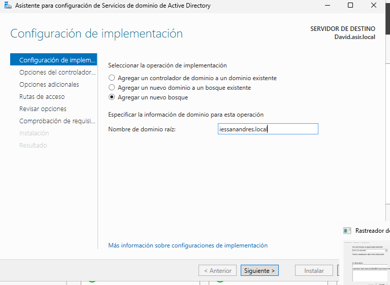

Le asignamos una contraseña para el modo de restauración de servicios de directorio.
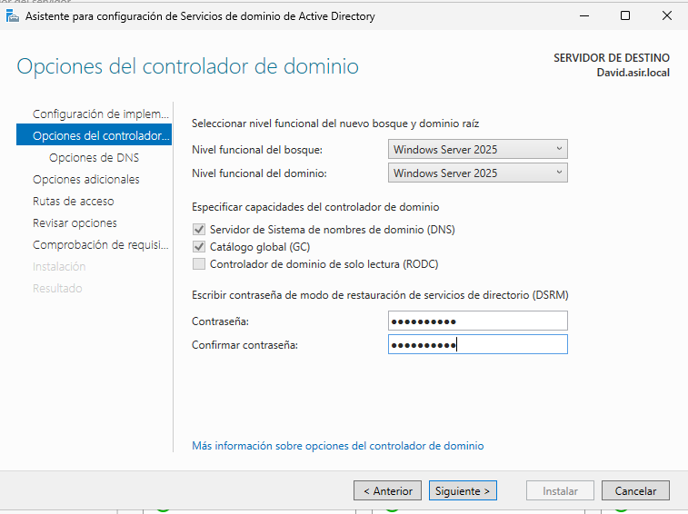

Y clicamos en siguiente hasta llegar a la instalacion.
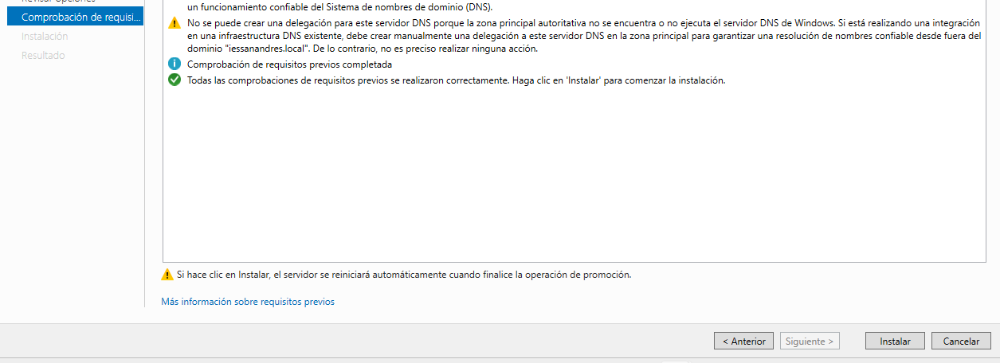

### Tarea 2: Diseño de la Estructura de Unidades Organizativas (UO)
Usando la consola “Usuarios y equipos de Active Directory” (dsa.msc), debes crear una jerarquía de Unidades Organizativas que refleje la estructura del centro.

Requisito: La estructura debe ser lógica y permitir aplicar políticas de forma diferenciada. Se propone la siguiente estructura (puedes mejorarla si lo justificas):

- IES San Andres (UO Raíz para la gestión del centro)
  - Alumnado
    - Informatica
      - DAM
      - DAW
      - ASIR
      - SMR
      - IAyBD
    - Administracion
      - AFI
      - GAD
      - SCO . Profesorado
      - Informatica
      - Administracion
  - Personal_PAS (Personal de Administración y Servicios)
  - _Grupos (UO para almacenar todos los grupos de seguridad)
  - _Equipos (UO para los equipos del dominio)
    - Aulas_Informatica
    - Aulas_Administracion
    - Despachos

Para crear las unidades organizativas iremos a Administrador del servidor>Herramientas>Usuarios y esquipos de active directory
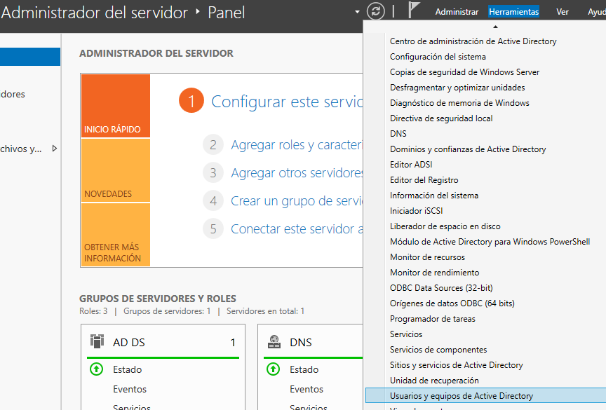

Una vez aqui hacemos clic derecho en el domnio, clicamos en nuevo y seleccionamos unidad organizativa.
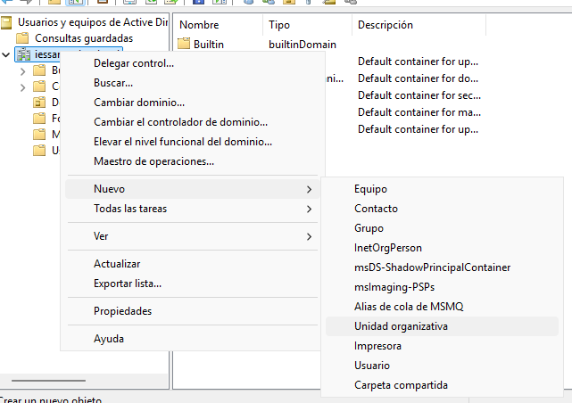

Le damos un nombre a aceptamos.
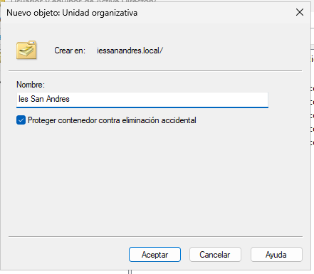

Hacemos lo mismo haciendo clic derecho ahora en Ies San Andres.
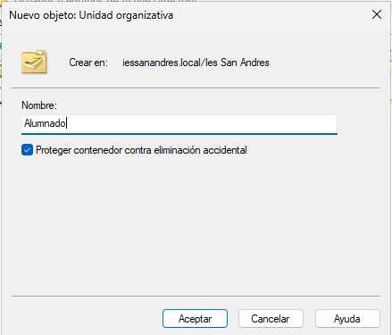

Y hacemos lo mismo hasta a que quede asi.
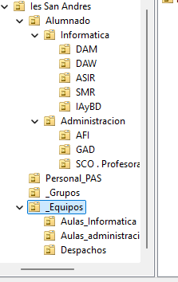

### Tarea 3: Creación de Usuarios y Grupos
Debes poblar la estructura con algunos usuarios y grupos de ejemplo.

Crear Usuarios:
- Crea 2 alumnos de ejemplo dentro de la UO ASIR (ej. alu_asir_1, alu_asir_2).
- Crea 2 alumnos de ejemplo dentro de la UO AFI (ej. alu_afi_1, alu_afi_2).
- Crea 1 profesor en la UO Profesorado\Informatica (ej. prof_info_1).
- Crea 1 usuario en la UO Personal_PAS (ej. pas_1).

Para crear los usuarios tenemos que ir al grupo en el que lo crearemos y aqui hacemos clic derecho, seleccionamos nuevo y clicamo en usuario.

Le damos nombre y nombre de inicio de sesion
Crear Grupos de Seguridad:
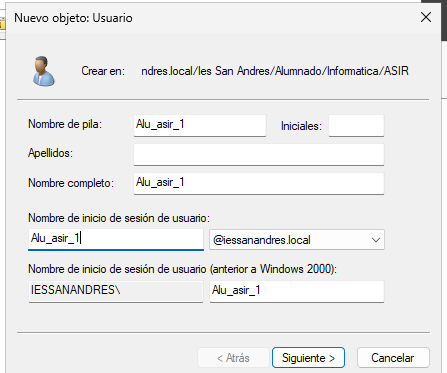

Le damos una contraseña 
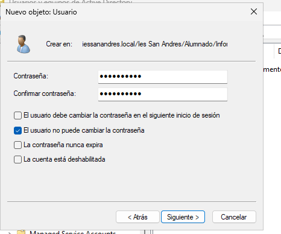

Y finalizamos
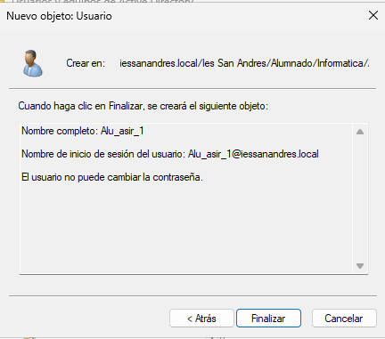

Repetimos los pasos para cada uno de los usuarios
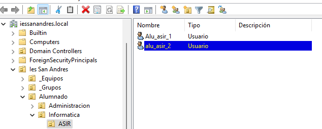
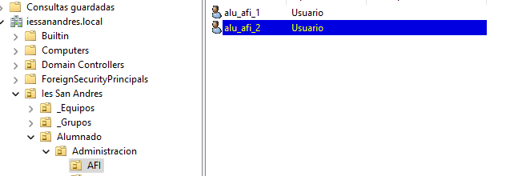
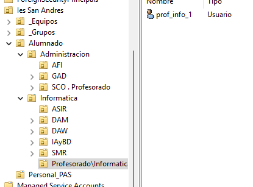
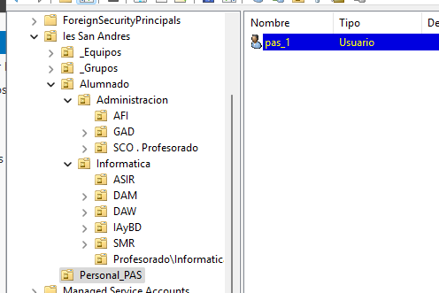
- Dentro de la UO _Grupos, crea los siguientes grupos de seguridad (Globales):
- GRP_Alumnos_DAM
- GRP_Alumnos_AFI
- GRP_Profesores_Informatica
- GRP_Personal_PAS
- GRP_Alumnos_General (Un grupo que contendrá a  todos los alumnos)
- GRP_Profesores_General (Un grupo que contendrá a todos los profesores)
Asignar Miembros:
- Añade los usuarios que creaste a sus grupos correspondientes.
- Haz que GRP_Alumnos_DAM y GRP_Alumnos_AFI sean miembros del grupo GRP_Alumnos_General.
  
Para crear los grupos hacemos clic derecho en _Grupos, clicamos en nuevo y seleccionamos grupo
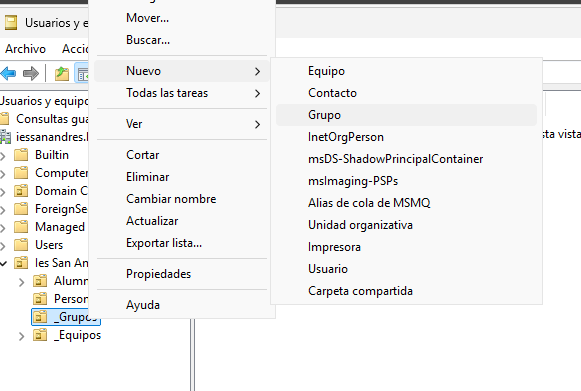

Le damos un nombre y aceptamos
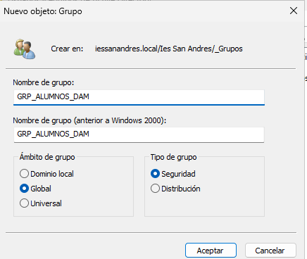

  
  Para asiganar miembros haremos clic derecho en GRP_Alumnos_DAM, vamos a prodiedades y miembros de.
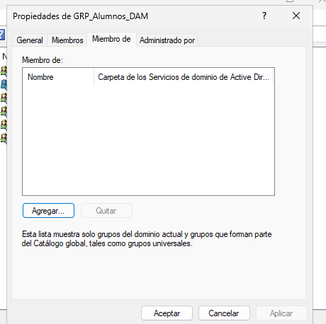

Una vez aqui clicamos en agregar, escribimos el nombre del grupo y aceptamos.
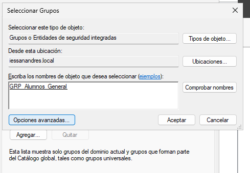

Y repetimos lo mismo con el otro grupo 
Tarea 4: Restricción de Horas de Inicio de Sesión
La dirección del centro ha solicitado que los alumnos solo puedan usar los equipos del dominio durante el horario lectivo.

Selecciona simultáneamente a los 4 usuarios de tipo “alumno” que creaste (puedes usar Ctrl + Clic).
Accede a sus Propiedades (esto editará las propiedades de todos a la vez).
Ve a la pestaña “Cuenta” y haz clic en “Horas de inicio de sesión”.
Configura las horas para que solo se permita el inicio de sesión de Lunes a Viernes, de 8:00 a 15:00. El resto del tiempo debe estar denegado.
Verifica que el personal (profesor y PAS) sigue teniendo acceso 24/7 (que es la configuración por defecto).

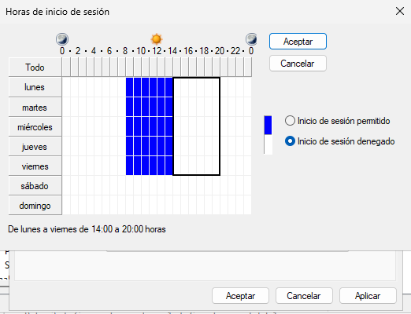