Creación de usuarios y grupos
Siguiendo la práctica del otro día, crea una carpeta personal para todos los alumnos de ASIR.

Primero creamos un grupo con los usuarios con los que vamos a compartir la carpeta.
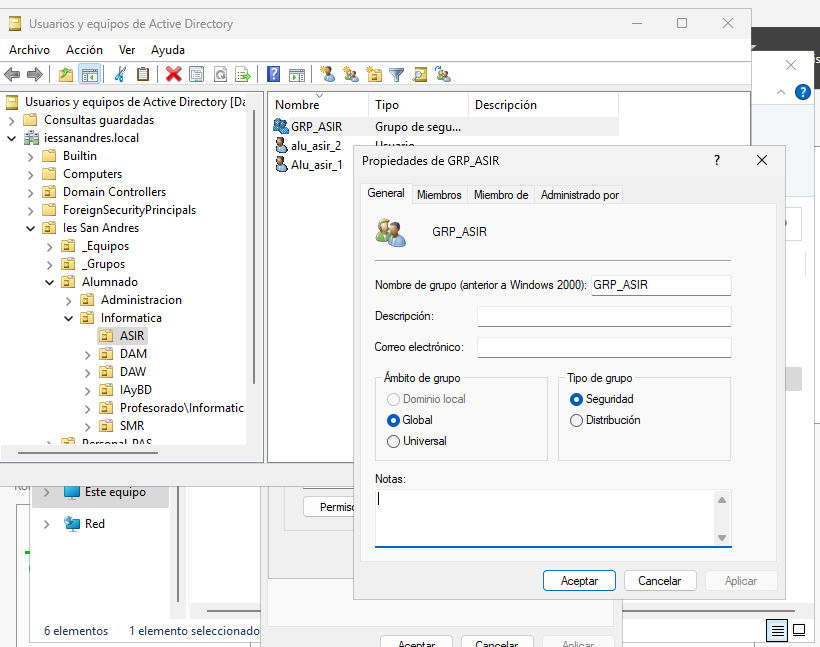

Añadimos los usuarios al grupo haciendo clic derecho en el grupo, y en pripiedades vamos a miembros, aqui escribimos los nombres de los usuarios que queremos añadir.
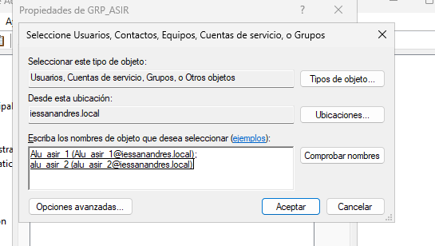

Creamos la carpeta share 
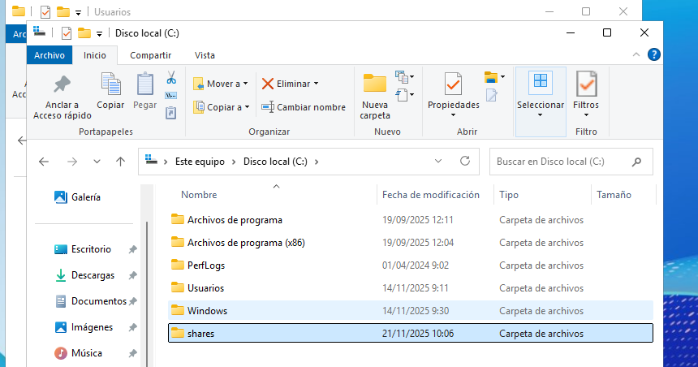

Carpetas personales
Instala el Administrador de recursos del servidor de archivos que está dentro del rol Servicios de archivos y almacenamiento
Utilizando la herramienta Servicios de archivos y de almacenamiento del Administrador del servidor, crea una carpeta para cada usuario dentro de C:\shares y realiza los pasos necesarios para que ambos usuarios puedan ver esta carpeta como una unidad de red identificada con la letra H:
Comprueba que la carpeta de cada usuario solo pueda ser accedida por él mismo.

Hacemos click derecho sobre la carpeta, vamos a propiedades, compartir y hacemos click en uso compartido avanzado, una vez aqui, marcamos la casilla de compartir carpeta y le damos un nombre.

Ahora clicamos en permisos, clicamos en agregar y aqui escribimos el nombre de los usuarios que van a tener acceso a esta carpeta.
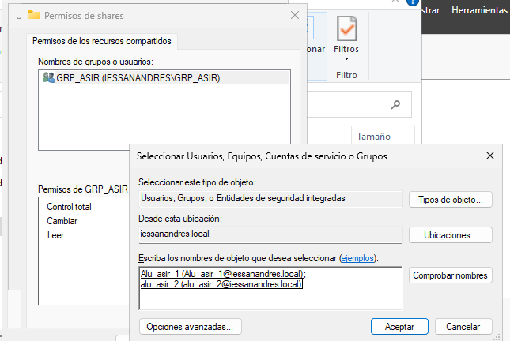

Le damos permisos, aplicamos y aceptamos.
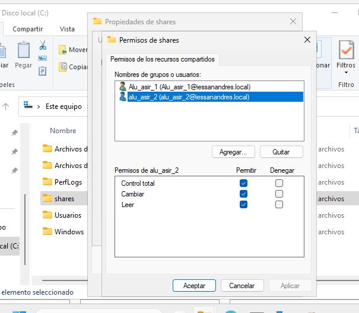

Ahora vamos a herramientas, usuarios y equipos de active directory, seleccionamos los usuarios con los que vamos a compartir la carpeta y seleccionamos propiedades.
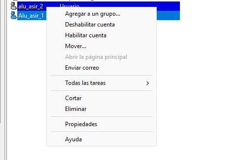

Vamos a perfil, marcamos la casilla de carpeta particular, conectar y escribimos la ruta de la carpeta
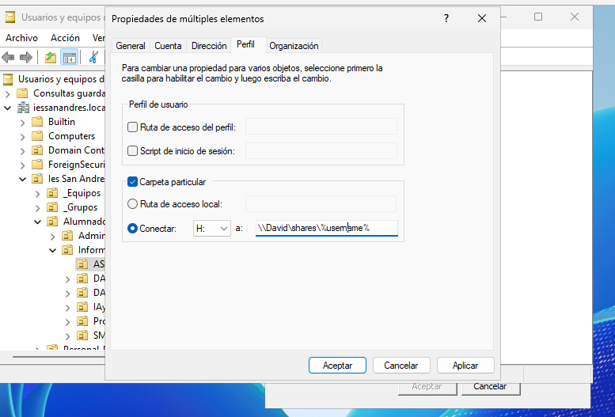

Carpetas compartidas por un grupo
Crea en C:\shares una carpeta llamada apuntes y realiza las tareas necesarias para que los alumnos de ASIR puedan acceder a ella como un espacio de almacenamiento compartido con permiso de lectura.
Luego crea otra llamada práctica en la que tengan permiso de lectura y escritura

Dentro de shares creamos la carpeta de apuntes, lo compartimos con el grupo y le damos permisos de lectura

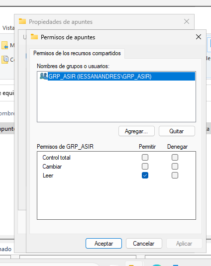

Hacemos lo mismo con practica dándole permisos de lectura y escritura.
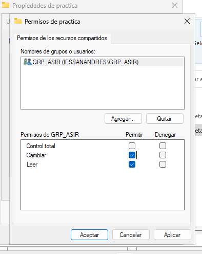

Ahora iremos a la carpeta netlogon y creamos un script llamado conecta.bat

Q tendra lo siguiente
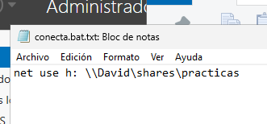

Vamos a las propiedades de los usuarios, en el perfil marcamos la casilla de script de inicio de sesion y escribimos el nombre que le hemos dado al script, una vez hecho eso clicamos en aceptar.
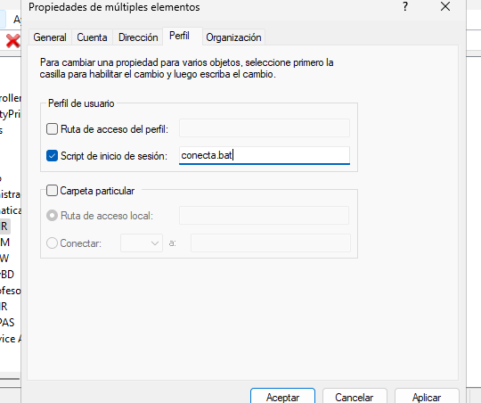