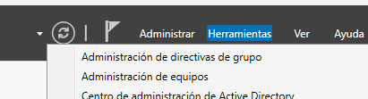
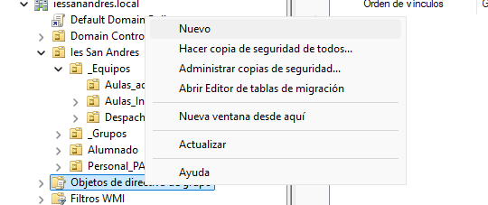
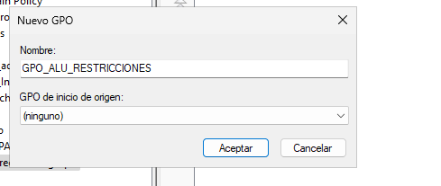
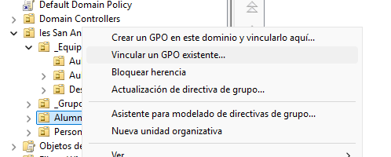
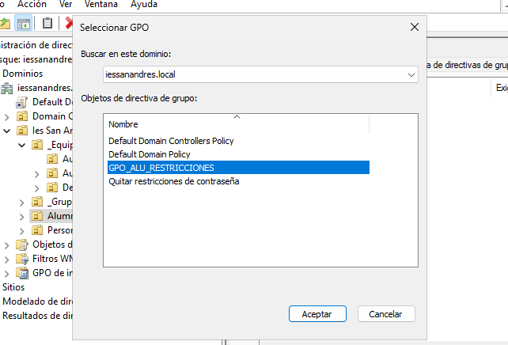
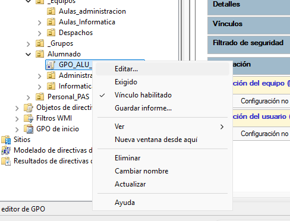
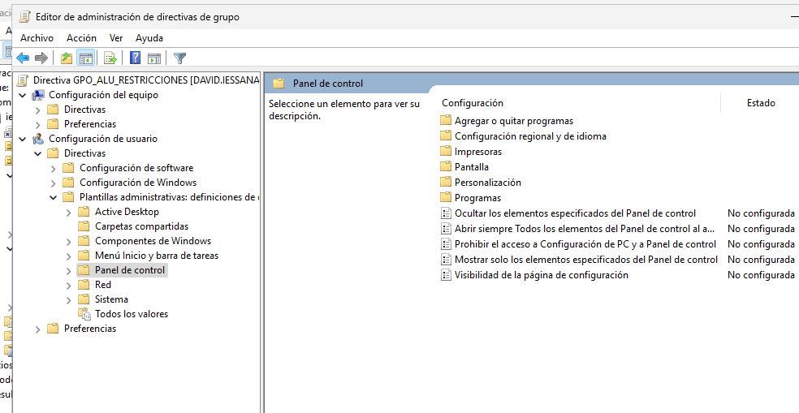
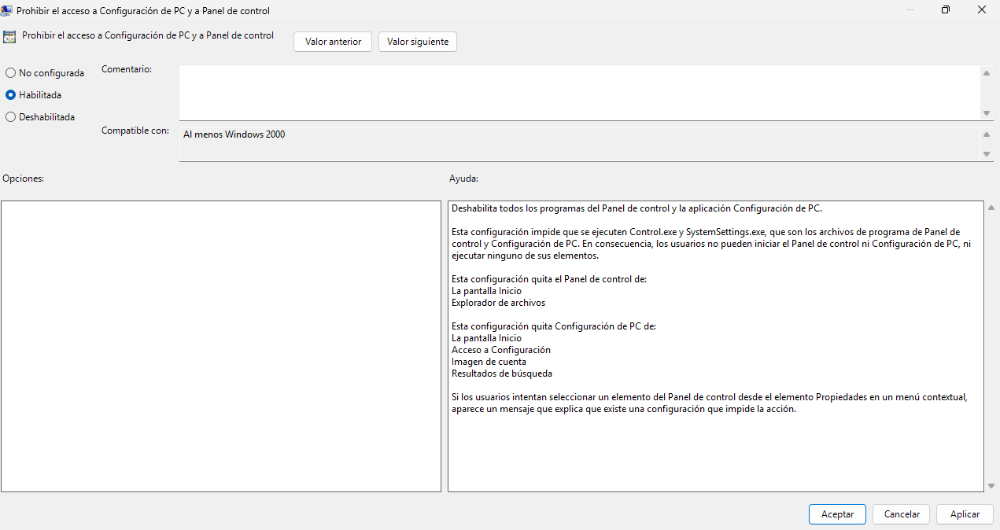
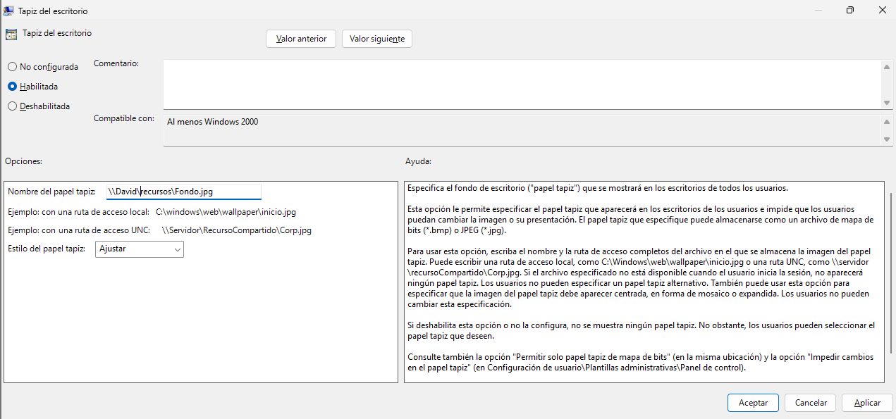
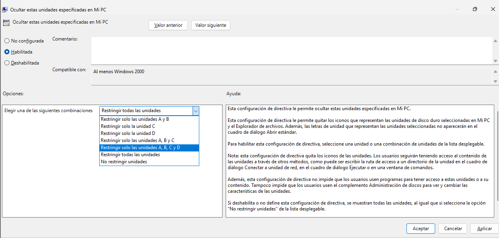

Tarea 1.1: Creación del GPO “Restricciones Alumnos”
Crea un nuevo GPO llamado GPO_ALU_RESTRICCIONES.
Vincula este GPO a la UO raíz Alumnado.
Configura las siguientes restricciones (Configuración de Usuario -> Políticas):
Bloqueo del Panel de Control: navega a Plantillas administrativas > Panel de control. Habilita la política “Prohibir el acceso al Panel de control y a la configuración del equipo”.
Establecer Fondo de Escritorio: navega a Plantillas administrativas > Escritorio > Escritorio. Habilita la política “Fondo de escritorio” y establece una ruta de red válida (ej. \\servidor_dc\recursos\fondo.jpg).
Ocultar unidades de disco: navega a Plantillas administrativas > Componentes de Windows > Explorador de archivos. Habilita la política “Ocultar estas unidades específicas en Mi PC” y selecciona la opción “Restringir las unidades A, B, C y D”.

Para crear un nuevo GPO iremos a Administracion de directivas de grupo

Aqui haremos clic derecho en objeto de directiva de grupo y seleccionamos nuevo.

Le damos nombre.

Para vicular la carpeta,en administracion de directivas de grupo, hacemos clic derecho sobre ella y seleccionamos la opcion que dice vincular a un GPO existente.

Clicamos sonre el que queremos y aceptamos.

Para configurar las restricciones hay que hacer clic derecho sobre la GPO y seleccionar editar.

Despues vamos a configuracion de usuario>directivas>Plantillas administrativas>Panel de control

Para habilitar la politica de bloqueo de panel de control, hacemos doble clic en sobre esta, marcamos la casilla de habilitada, aplicamos y aceptamos.

Para establecer Fondo de Escritorio vamos a Plantillas administrativas>Active Desktop>Active Desktop marcamos la casilla de habilitar y en la ruta escribimos la de una carpeta compartida, aceptamos y aplicamos.

Para ocultar las unidades de disco tenemos ir a 
 Plantillas administrativas>Componentes de Windows>Explorador de archivos, marcamos la casilla de habilitar y seleccionamos la opcionde de restringir las unidades A, B, C y D, por ulimo aplicamos y guardamos
