1.1. Protección de cuentas y acceso
Renombrar cuenta de administrador: por seguridad, la cuenta local Administrador es un objetivo común de ataques. Configura la directiva para que esta cuenta se renombre a Admin_Local_IES.

Creamos una GPO hacemos clic derecho y seleccionamos editar y vamos a la soguiente ruta
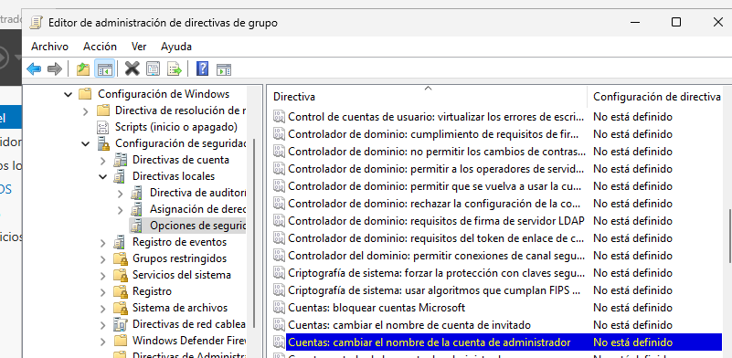

Habilitamos la cuenta de administrador, aplicamos y aceptamos.
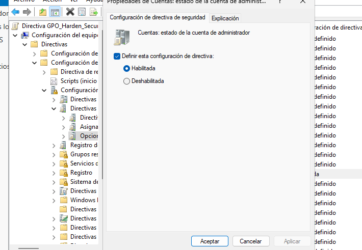

Ahora en esta directiva le damos el nombre.
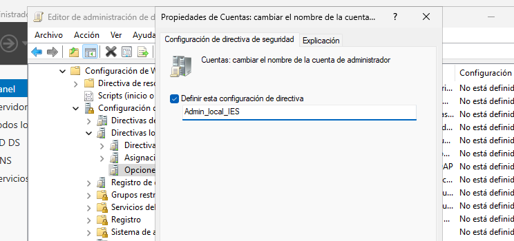

Una vez hecho esto la aplicamos en cmd usando 
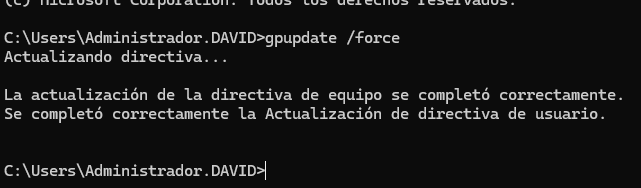

Inicio de sesión interactivo: configura el equipo para que no requiera pulsar Ctrl+Alt+Supr para iniciar sesión.

Ahora buscamos inicio de sesion interactivo: no requerir Ctrl+Alt+Supr, clicamos en habilitar aplicamos y aceptamos.
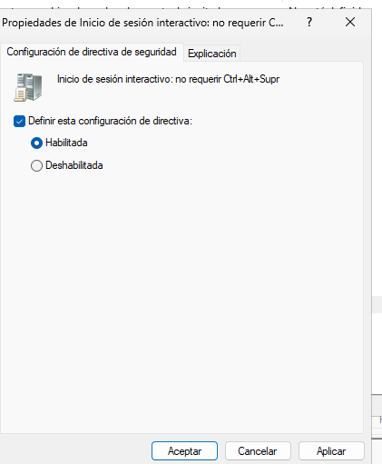

1.2. Aviso legal (Consentimiento Informado)
Configura el sistema para que, antes de iniciar sesión, muestre un mensaje legal a los usuarios.
- Título: Aviso de Seguridad del IES San Andrés
- Texto: El uso de este equipo está monitorizado. El acceso está restringido únicamente a personal y alumnado autorizado.

Para el titulo iremos aqui Título del mensaje para los usuarios que intentan iniciar sesión.
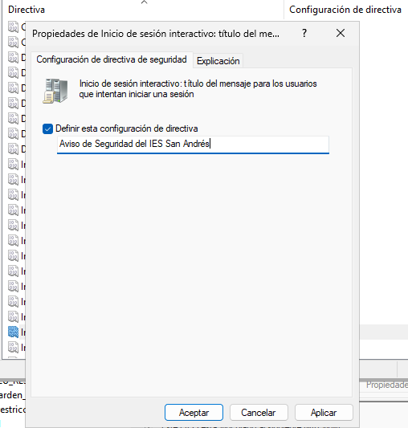

Para el texto buscaremos texto del mensaje para los usuarios que intentan iniciar sesión.
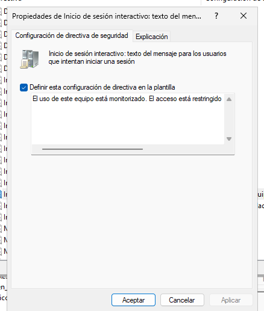

1.3. Privacidad y apagado
Privacidad: Configura el inicio de sesión interactivo para que no muestre el último nombre de usuario que inició sesión.
Apagado: Deshabilita la opción que permite apagar el sistema sin tener que iniciar sesión. Queremos evitar que alumnos apaguen equipos de aulas remotamente o desde la pantalla de bloqueo sin identificarse.

Para que no muestre el último nombre de usuario que inició sesión hay que buscar no mostrar ultimo inicio de sesion.
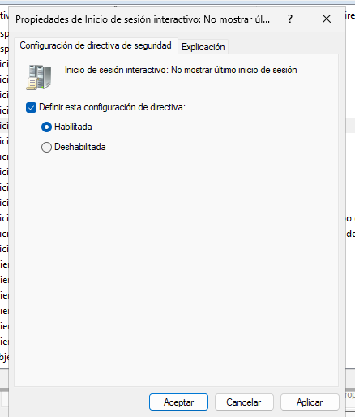

La directiva de apagado se encuentra justo encima de la otra.
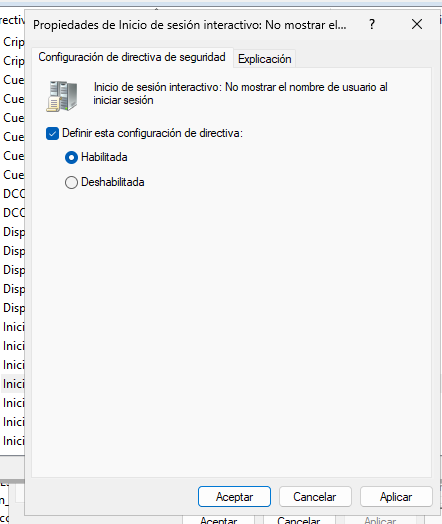

Para habilitar todo volvemoa a usar gpupdate /force
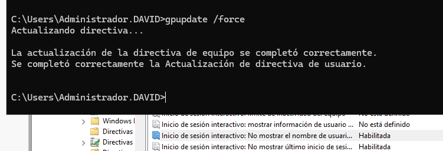

Parte 2: Preferencias de Grupo (GPP) y segmentación
En esta sección usarás Preferencias (Configuración de usuario -> Preferencias) en lugar de Directivas (Policies). Debes crear una GPO llamada GPO_Configuracion_Usuario_Dinamica y vincularla a la raíz del dominio (o a las UOs de usuarios pertinentes).
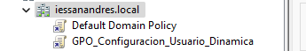

2.1. Mapeo de unidades de red (Drive Maps)
Los profesores necesitan acceder a una carpeta compartida para sus materiales, pero los alumnos no deben ver esa unidad.

Crea una unidad de red mapeada (ej. letra P:) que apunte a una carpeta compartida del servidor (puedes crear una carpeta compartida llamada Recursos_Profesores en el DC).
Requisito: Usa Item-Level Targeting (Destinatarios) para que esta unidad SOLO se monte si el usuario pertenece al grupo GRP_Profesores_General.

Creamos la carpeta y la compartimos con el grupo que nos pide.
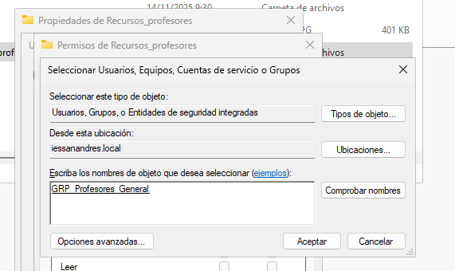

Le damos permisos, aplicamos y aceptamos.
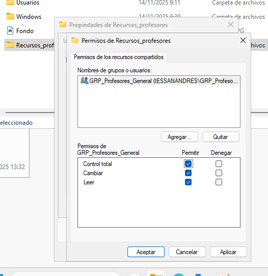

Ahora editamos la GPO vamos a Configuración de usuario > Preferencias > Configuración de Windows > Asignaciones de unidades.
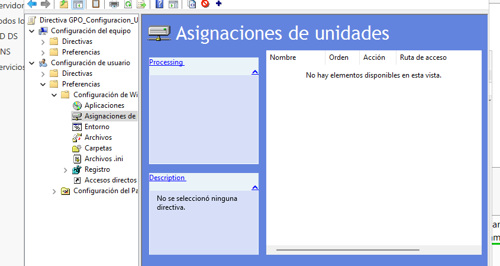

Aqui hacemos clic derecho y seleccionamos nuevo, unidad asignada.
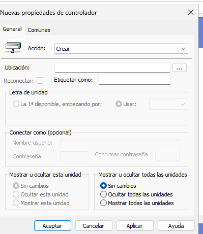

Hacemos los siguientes cambios
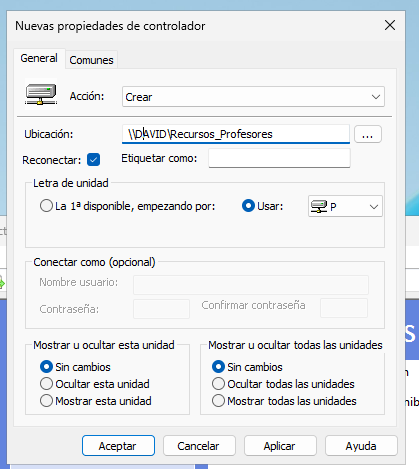

Ahora para el Item-Level Targeting vamos a la pestaña de comunes.
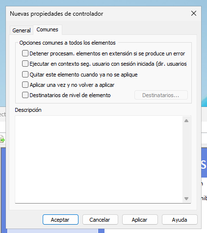

Marcamos destinatarios.
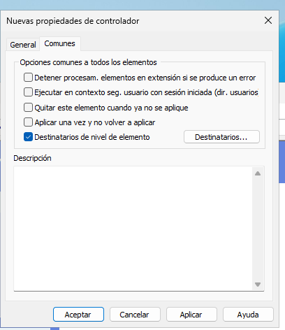

Clicamos a en destinatarios, hacemos clic en nuevo y seleccionamos grupo de seguridad
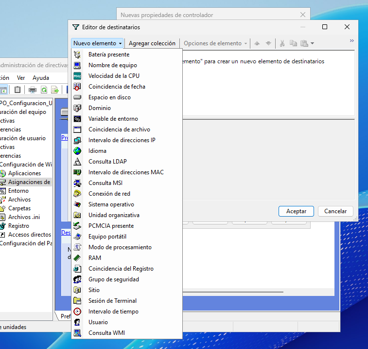

Ahora clicamos en los tres puntitos y escribimos el grupo, tambien nos tenemos que asegurar que este marcada la casilla de Usuario de grupo.
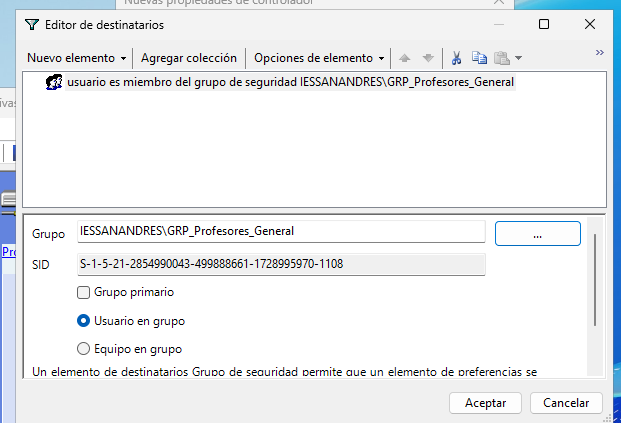

Por ultimo aplicamos y aceptamos.
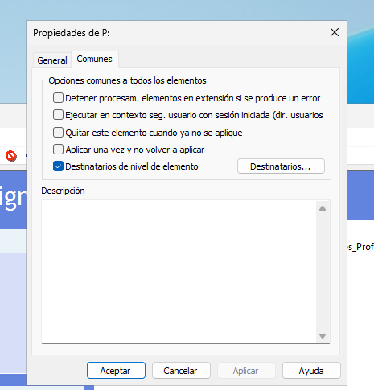

2.2. Accesos Directos
El departamento de informática quiere un acceso directo a la Intranet en el escritorio, pero solo para los alumnos del ciclo DAM, ya que son los que están desarrollando la nueva web.

Crea un acceso directo en el Escritorio que apunte a http://intranet.iessanandres.local (puedes inventar la URL).
Requisito: Usa Item-Level Targeting para que este acceso directo SOLO aparezca a los miembros del grupo GRP_Alumnos_DAM.

Para eso hay que ir a configuracion de usuario > preferencias > configuracion de windows > accesos directos
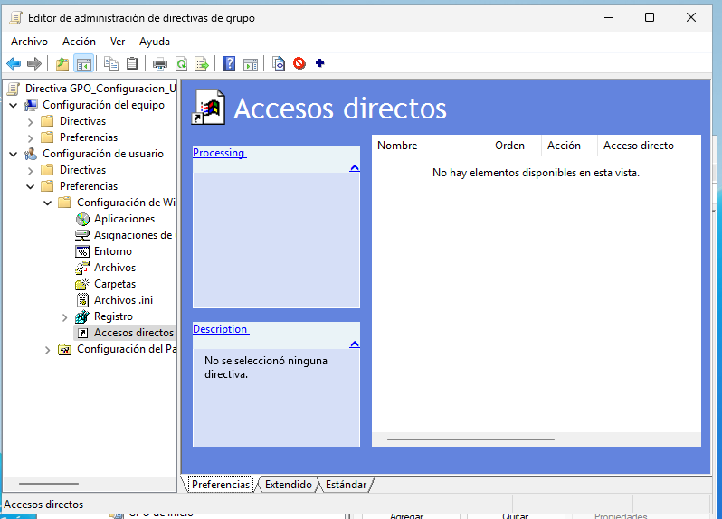

Hacemos clic derecho en accesos directos, clicamos en nuevo y seleccionamos acceso directo
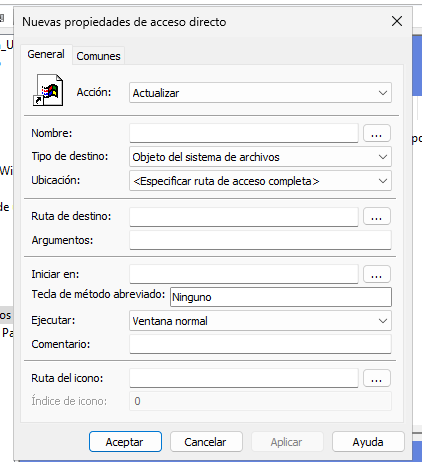

Aqui añadimos lo siguiente.
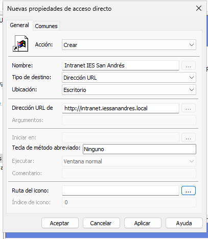

Ahora vamos a la pestaña de comunes y marcamos destinartarios de nivel de elemento
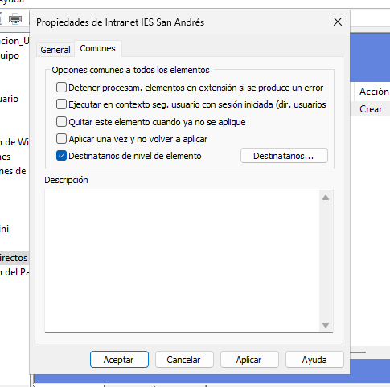

Volvemos a elgir grupo de seguridad
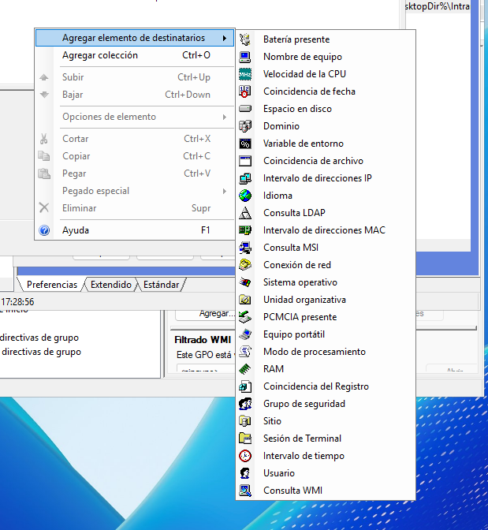

Y elegimos el grupo.
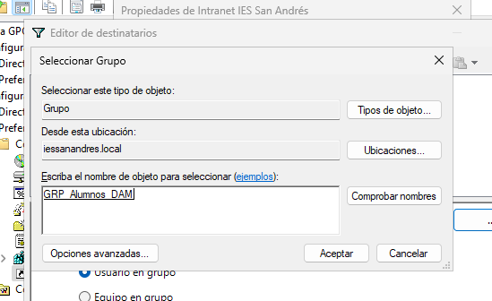

Parte 3: Filtrado WMI Avanzado

3.2. Diferenciación de Sistema Operativo (Workstation vs Server)
Queremos aplicar una configuración de Control de Cuentas de Usuario (UAC) específica, desactivando la “Detección de instalaciones de aplicaciones”, pero SOLO a los equipos Clientes (Windows 10/11), nunca a los Servidores del dominio.

Crea una GPO llamada GPO_Clientes_UAC.
Configura la directiva de UAC para deshabilitar la detección de instalaciones.
Crea y vincula un Filtro WMI que seleccione únicamente sistemas operativos de escritorio (no servidores).
Pista: Consulta la clase Win32_OperatingSystem y la propiedad ProductType. El valor 1 corresponde a Workstation (Cliente), mientras que 2 y 3 son Servidores.

Creamos la directiva
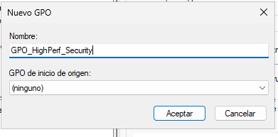

Ahora hacemos clic derecho, seleccionamos editar y vamos a configuracion del equipo > directivas > confugaracion de windows > configuracion de seguridad > Directivas locales > opciones de seguridad.
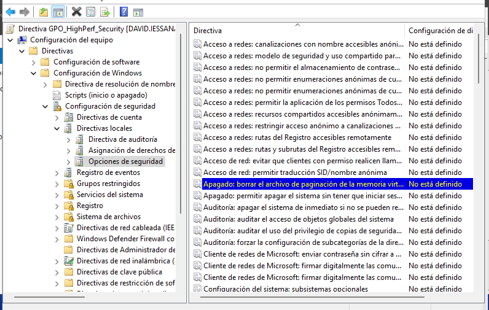

La habilitamos y aplicamos y aceptamos 
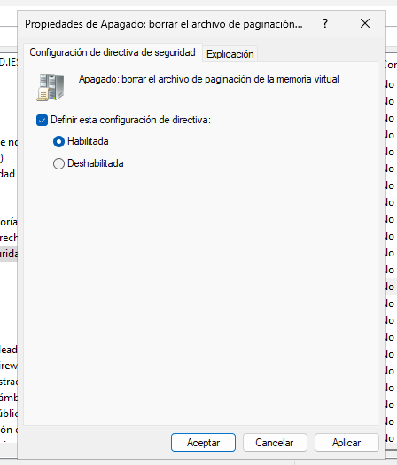

Ahora vamos a filtros wmi, aqui hacemos clic derecho y seleccionamos nuevo
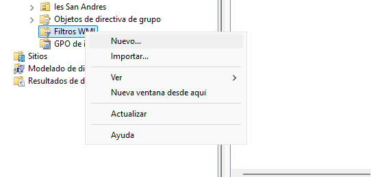

Le damos un nombre

Ahora clicamos en agregar, escribimos la consulta y guardamos.
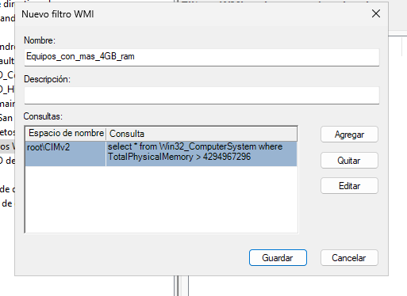

3.2. Diferenciación de Sistema Operativo (Workstation vs Server)
Queremos aplicar una configuración de Control de Cuentas de Usuario (UAC) específica, desactivando la “Detección de instalaciones de aplicaciones”, pero SOLO a los equipos Clientes (Windows 10/11), nunca a los Servidores del dominio.

Crea una GPO llamada GPO_Clientes_UAC.
Configura la directiva de UAC para deshabilitar la detección de instalaciones.
Crea y vincula un Filtro WMI que seleccione únicamente sistemas operativos de escritorio (no servidores).
Pista: Consulta la clase Win32_OperatingSystem y la propiedad ProductType. El valor 1 corresponde a Workstation (Cliente), mientras que 2 y 3 son Servidores.

Creamos la gpo
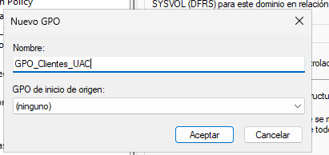

Ahora vamos a Ccnfiguracion del equipo > cirectivas > configuracion de windows  > configuración de seguridad > directivas locales > opciones de seguridad
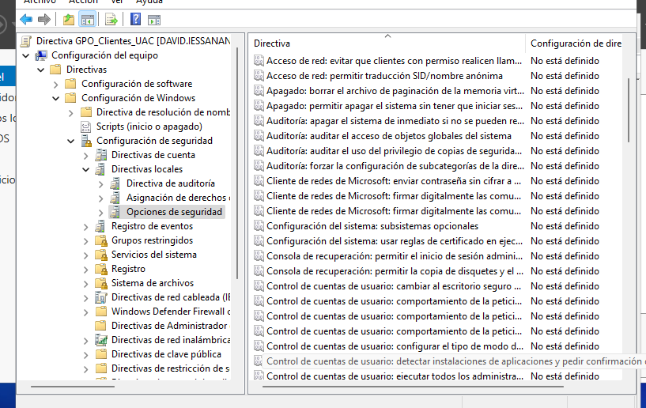
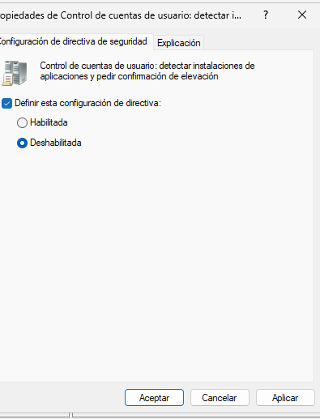

Creamos el filtro wmi
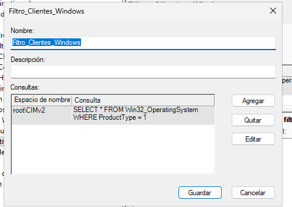